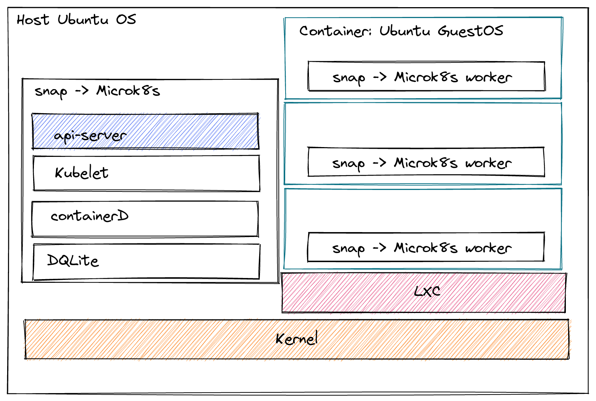

# microk8s.localcluster


A multi-node local microk8s example.
This uses LXD and is designed to work on Ubuntu.

_In this example we use a single control plane node - you can use as many as you like_



## Up and running

```
./launch.sh
# Install metallb loadbalancer ( optional )
kubectl apply -f https://raw.githubusercontent.com/metallb/metallb/v0.11.0/manifests/namespace.yaml
kubectl apply -f https://raw.githubusercontent.com/metallb/metallb/v0.11.0/manifests/metallb.yaml

kubectl apply -f metallb.yaml ( optional config )
```

You can now emulate a generic kubernetes cluster with external load balancing.
